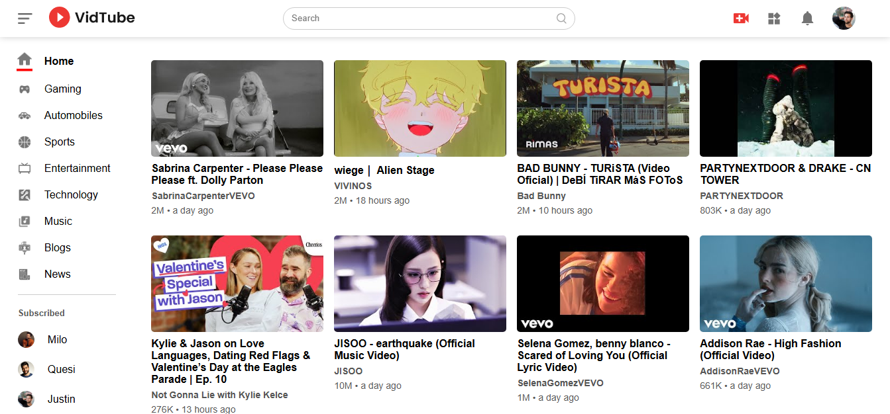
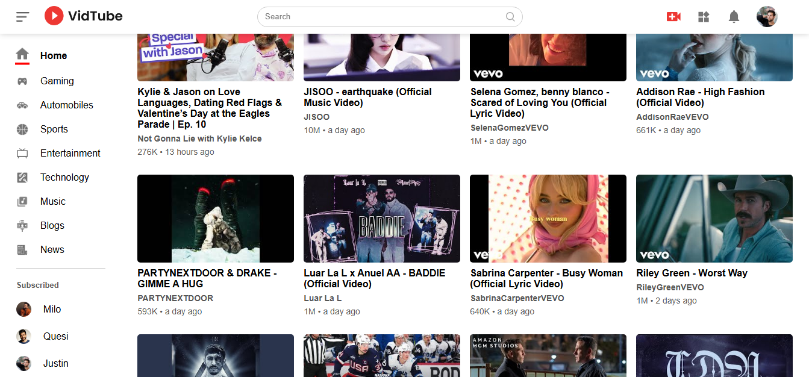
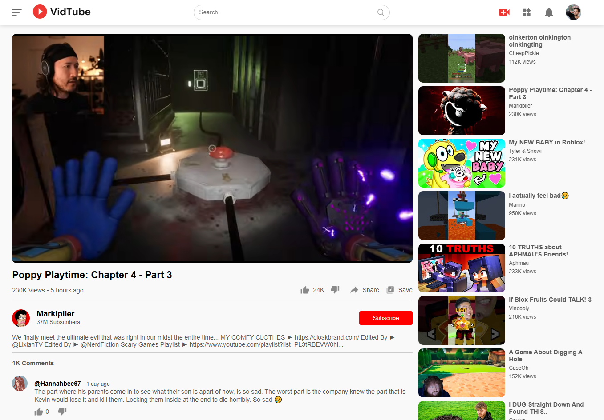
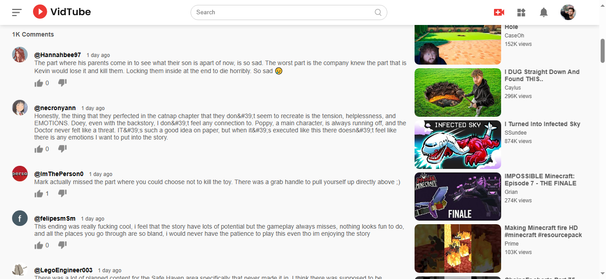

# 🎥 YouTube Clone

This is a YouTube clone built with **React** and **Vite**, using the YouTube API to fetch information about videos, categories, and comments.

## 🚀 Características

- **Home Page**: Displays a list of popular videos.
- **Category Sidebar**: Allows you to filter videos by the selected category.
- **Video Playback**: Clicking on a video opens a new page where you can watch it.
- **Video Details**: Displays the title, channel, views, and other relevant information.
- **Comments**: Lists comments on the video.
- **Related Videos**: Displays suggestions for other videos based on the current one.
- **Credential Handling**: The YouTube API key is managed via a `.env` file for added security.

## 🛠 Tecnologías utilizadas

- **React**: For building the frontend.
- **Vite**: JavaScript bundler for fast and efficient development.
- **YouTube API**: To obtain information about the videos (id, category, title, description, comments, etc).
- **React Router**: Handle navigation between different pages within the application.
- **Tailwind CSS**: Interface design and styling.
- **Fetch API**: Make HTTP requests to the YouTube API and fetch data dynamically.

## 📸 Screenshots

#### 1. Home Screen



#### 2. Videos Navigation



#### 3. Playing Video



#### 4. Comments Section



## 📦 Installation and Launch

1. Clone the repository:
   ```bash
   git clone https://github.com/tu-usuario/tu-repositorio.git
   ```
2. Enter the project folder:
   ```bash
   cd nombre-del-proyecto
   ```
3. Install the dependencies:
   ```bash
   npm install
   ```
4. Create a `.env` file in the root of your project and add your YouTube API key:
   ```plaintext
   VITE_YOUTUBE_API_KEY=TU_CLAVE_AQUI
   ```
5. Start the development server:
   ```bash
   npm run dev
   ```

## 🔑 Environment Variables

Before running the project, you must set the following environment variables.
Create a `.env` file in the project root and add the following:

```env
VITE_YOUTUBE_API_KEY=your_api_key
```

## 📜 How to Use

- Explore the homepage and select a category to see related videos.
- Click on a video to view its information, play it, and see comments.
- Browse suggested videos to continue exploring content.

## 🌍 Project Online

🔗 [See the project here](https://vercel.com)

## 👨‍💻 Author

Created by [Juan Amador](https://github.com/juanamador1009).
